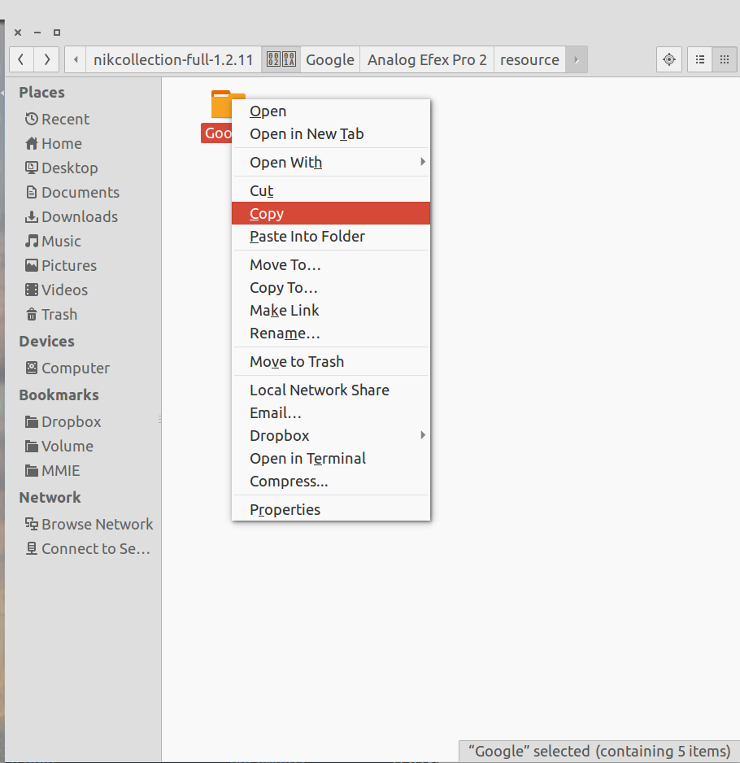
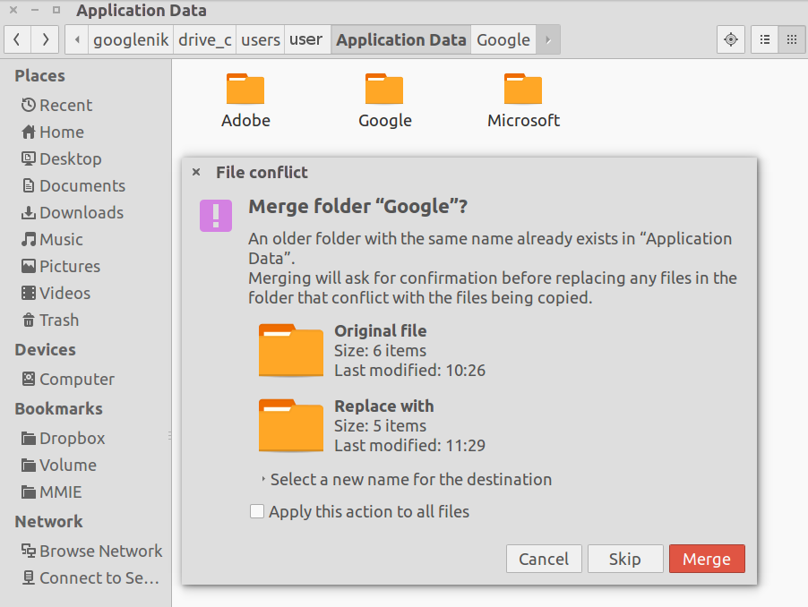

**this guide is unmantained**, instead I created a script
for *playonlinux*, you can read more in the [`README.md`](README.md) 
or get the script [here](nikplayonlinux.sh) if you are already familiar
with *playonlinux*.

##Install Wine and PlayOnLinux

    sudo apt-get install wine playonlinux

##Download and Install Google NIK Collection

    cd ~/
    wget https://dl.google.com/edgedl/photos/nikcollection-full-1.2.11.exe

Now open PlayOnLinux from Ubuntu Dash, click **Configure**.

Click **New**, Next, **64-bits Windows installation**, Next, **1.7.31**,
Next, type `googlenik` as the name of the VirtualDrive. It will create an entry
called googlenik. Click on it, Click **Install Components**, and select
`vcrun2012` from the list. Install it. Do the same to install
`Microsoft Core Fonts`.

Now on the PlayOnLinux home screen, click **Install**, in the search bar type
`Microsoft Fonts`, and install that to the `googlenik` instance.

Now, back to the tabbed view of the PlayOnLinux configuration, still in the
googlenik instance, click on Miscellaneous, and click **Run a .exe file in this
virtual drive**. Select the file `nikcollection-full-1.2.11.exe` you just
downloaded.

Follow what's on the screen - basically just click next and wait for it to
finish. In case of errors, choose **ignore**.

Now, open Nautilus, right click on the `nikcollection-full-1.2.11.exe`, click
**Extract Here**. On the folder fourth folder - [it has an invalid char name as
name](img/nikcopyfromtar1.png) - , there is a Google folder with five items in
it.

Copy it and navigate to your PlayOnLinux drive folder for the `googlenik`
instance. Paste it on `users\YOURUSERNAME\Application Data` and in the
`users\Public\Application Data` folder. This will fix previous copying errors
on the installer.

Now time to make the shortcuts to use the Nik Filters in standalone first,
back to the tabbed view of the PlayOnLinux configuration, still in the
googlenik instance. Click on **Make a new shortcut from this virtual drive**. In
the window that is open, if you are using a 64-bits Window Installation as I
told you to use before, select the second below of a filter and proceed. Repeat
until you have done this to each of the second NIK Filter available.

Time to test. I have a [RIO image here](img/rio.png) that we can use for
testing.  **NIK FILTERS ARE DESTRUCTIVE**, they will save the file in place.
Open a shell and type:

    /usr/share/playonlinux/playonlinux --run "Dfine2" rio.png

##NIK Filters working under Wine

Right now, I could only use the following filters:

* Analog Efex Pro 2
    * Load time really slow (takes me 4 minutes)

* Color Efex Pro 4
    * Load time slow (takes me 2 minutes)

* Dfine2
    * Works perfectly, really fast.

* SHP3RPS
    * Works perfectly, really fast.

Each can be ran using:

    /usr/share/playonlinux/playonlinux --run "Analog Efex Pro 2" IMAGEFILE
    /usr/share/playonlinux/playonlinux --run "Color Efex Pro 4" IMAGEFILE
    /usr/share/playonlinux/playonlinux --run "Dfine 2" IMAGEFILE
    /usr/share/playonlinux/playonlinux --run "SHP3RPS" IMAGEFILE

##NIK Filters not working under wine

I couldn't find out how to use the following filters:

* HDR Efex Pro 2

* SHP3OS

* Silver Efex Pro 2

* Viveza 2

These filters are the only one that leave no log files when crashing. If you
know how to force them to leave logs, tell me.
